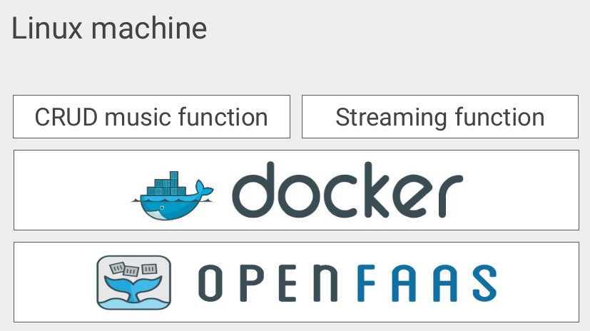
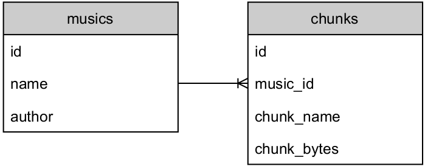

# Serverless Computing for Music Streaming

This repo proposes a model considering serverless computing techniques for music streaming, making use of the HTTP Live Streaming (HLS) protocol while running functions on the OpenFaaS platform. Serverless functions have been implemented on Python language.



## Database

MongoDB was chosen for storing unstructured binary data, as each chunk is stored in its binary form in order to provide high performance when consumed by the streaming function. The application uses two different MongoDB collections as stated in Fig. 5, whereas the first one stores the music metadata (music ID, music name and author) and the latter stores all the binary chunks related to each song (music ID, chunk ID, chunk name and binary data). It can be defined as an one-to-many correlation, as multiple binary chunks can be stored for a single music and each chunk represents a part of the final song. The HLS Multimedia Playlist file is also stored on the database and is treated as binary data.



## Application Programming Interface

An Application Programming Interface (API) developed in Python was also provided in order to interact with the CRUD function. This API acts as a wrapper for the HTTP requests, receiving data as function parameters and converting them to JSON structures expected by the backend function. Below is a simple usage of the API in order to add and list musics, as well as obtain information of a specific music. Lastly, all records are deleted from the database trough this same API.

 ```python
    import json

    api = MusicApi()

    print("Adding musics...")
    print(api.insert("Madonna", "Like a Prayer", '/home/gustavo/Like_A_Prayer.mp3'))
    print(api.insert("Coldplay", "Sky Full of Stars", '/home/gustavo/SkyFullOfStars.mp3'))
    print(api.insert("Erasure", "A Little Respect", '/home/A_Little_Respect.mp3'))
    print(api.insert("a-ha", "Take on me", '/home/TakeOnMe.mp3'))

    print()
    print("Listing musics...")
    all_musics = json.loads(api.list())
    for music in all_musics:
        print(music)

    print()
    print("Printing specific music data...")
    for music in all_musics:
        print(api.get(music["id"]))

    print()
    print("Printing data which does not exist...")
    print(api.get("11111"))
    print(api.get("22222"))
    print(api.get("33333"))

    print()
    print("Deleting musics...")
    for music in all_musics:
        print(api.remove(music["id"]))

    print()
    print("Listing musics...")
    all_musics = json.loads(api.list())
    for music in all_musics:
        print(music)
 ```

## Deployment

Both functions are built an deployed with faas-cli command-line tool. As the crud function requires FFMPEG library on Linux container, the argument ADDITIONAL PACKAGE must be passed in the command-line. The same does not happen for the streaming function as it does not rely on any external tool, thus resulting in a simpler command-line.

In order to deploy the Streaming function:
 
    cd functions/streaming
    faas-cli up -f streaming.yml

In order to deploy the CRUD function:
    
    cd functions/crud
    faas-cli up -f crud.yml --build-arg ADDITIONAL_PACKAGE=ffmpeg

The following command is used to start an execution MongoDB container:

    docker run -d -p 27017:27017 -p 28017:28017 -e MONGO_INITDB_ROOT_USERNAME=admin -e MONGO_INITDB_ROOT_PASSWORD=admin mongo